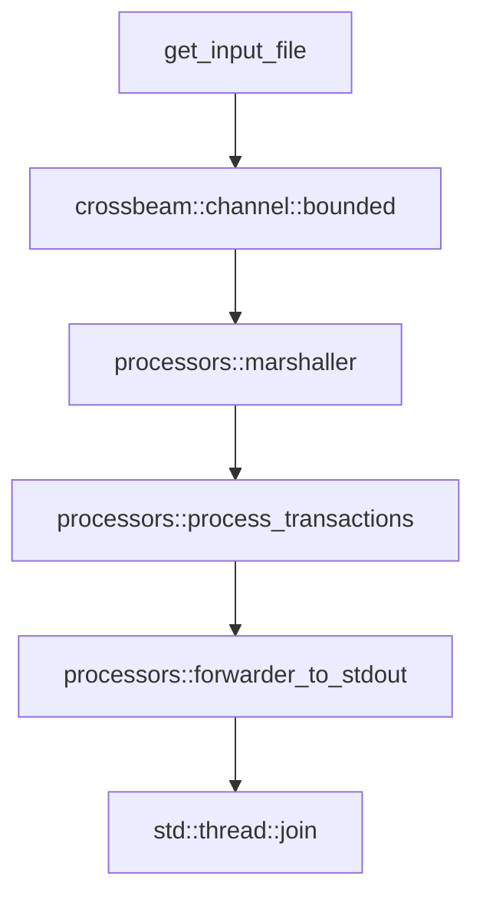

# Transactions processor

## Description

This is an implementation of a simple payment engine that reads a series of transactions from CSV, updates the client accounts, handles the disputes and chargeback, and outputs the state of clients' accounts as a CSV.

There is an assumption the transaction is a `u32` value.

## Entrypoint components



## How to run

```sh
cargo run -- tests/input.csv > output.csv
```

## Testing

Most of the edge cases are covered by unit tests in the `Payments` module

```sh
cargo test
```

## Assumptions

### Client ID

| Decision | Motivation |
|----------| -----------|
| The transaction generated by `client_id` "A" cannot be altered (Disputed etc..) by the client with id "B" | Transaction are attached to one account |

### Performance

| Decision | Motivation |
|----------| -----------|
| Marshaling and account processing are separated and put into different threads.| performance optimisation which could be useful in case of large volume of data|

### Extensibility

| Decision | Motivation |
|----------| -----------|
|The input (`io:Read`) is exposed to the root | we may want to attach the different data source |
|The output (`Sender<ClientID, Client)>`) is exposed to the root | we may want to use a different destination for data|
